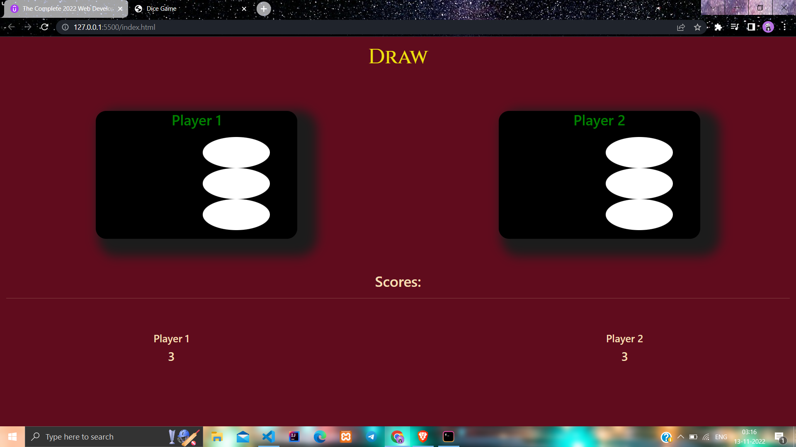

###DICE GAME USING JS

This is a dice game. Where 2 players - player 1 and player 2 are the 2 players
when the page reloads, randomly player 1 and player 2 are assigned a number respect to that
winner is announced.

This project is completely based on pure html, css and vanila js.

###Here are some screenshots:

